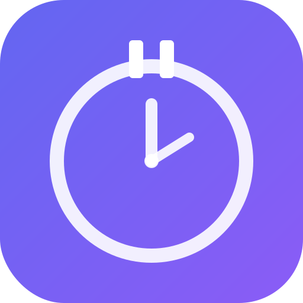

# AbortMe

A macOS desktop app that reminds you to take breaks while working. It runs in the menu bar, tracks your work and break activities, and helps you maintain healthy work habits.

<p align="center">
  
</p>

## Features

- **Work timer** — Configurable countdown timer (1-60 min) that pops up when it's time for a break
- **Menu bar integration** — Timer countdown visible in the macOS menu bar with a tray icon
- **Activity tracking** — Log what you're working on and what you do during breaks
- **Break timer** — Configurable break duration (1-30 min) with countdown
- **Idle detection** — Automatically pauses the timer when your computer is inactive (60s threshold)
- **Stats dashboard** — Day, week, and month views with charts showing your work and break patterns
- **Extend or break** — When the timer fires, choose to log work and take a break, or log and keep working
- **Audio alerts** — Beep sounds when the popup fires and when your break ends
- **Persistent data** — SQLite database stored in `~/Library/Application Support/AbortMe/`
- **Runs in background** — Closing the window keeps the app alive in the menu bar

## Tech Stack

- **Runtime**: [Bun](https://bun.sh)
- **Framework**: [Electrobun](https://electrobun.dev) (native macOS desktop)
- **Frontend**: React + Vite + TailwindCSS v4 + shadcn/ui (dark theme)
- **Database**: SQLite (via `bun:sqlite`)
- **Charts**: CSS-only (no chart library)

## Getting Started

### Prerequisites

- [Bun](https://bun.sh) v1.1+
- macOS (Apple Silicon or Intel)

### Install dependencies

```bash
cd native
bun install
```

### Development

```bash
# Start both Vite dev server and Electrobun
bun run dev

# Or run individually
bun run dev:vite        # Vite dev server on port 6001
bun run dev:electrobun  # Electrobun with watch mode
```

### Production build

```bash
bun run build
```

The built app will be at `native/build/dev-macos-arm64/AbortMe-dev.app`. Copy it to `/Applications` to install:

```bash
cp -R build/dev-macos-arm64/AbortMe-dev.app /Applications/
```

## Project Structure

```
native/
  src/
    main/           # Bun main process
      index.ts      # Window, tray, popup timer, idle detection
      db.ts         # SQLite database layer
    renderer/       # React frontend (Vite root)
      App.tsx       # Main app component
      components/
        WorkingStep.tsx   # Work countdown timer
        WorkStep.tsx      # Activity selection on popup
        BreakStep.tsx     # Break activity selection
        TimerStep.tsx     # Break countdown
        stats/            # Stats dashboard (Day/Week/Month views)
      lib/
        beep.ts           # Web Audio API beep sounds
    shared/
      rpc.ts        # RPC type definitions
      types.ts      # Shared TypeScript types
  assets/           # App icon + tray icon
  icon.iconset/     # macOS app icon set
```

## How It Works

1. A configurable work timer counts down in the background (visible in the menu bar)
2. When the timer fires, the app pops up and asks what you've been working on
3. You can either **take a break** or **keep working** (resets the timer)
4. If you take a break, select your break activities and a break timer starts
5. When the break ends, a beep plays and the work timer restarts
6. All sessions are logged to SQLite and viewable in the Stats dashboard

The app detects system idle time via `ioreg` and pauses the work timer when you're away from the computer.

## License

MIT
